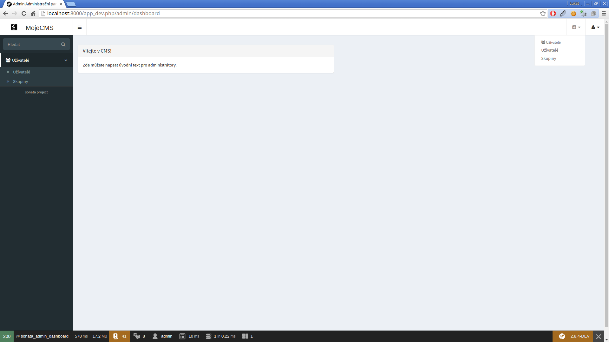

# Instalace Sonaty krok za krokem

### 1. Instalace Symfony 2.8

Verzi Symfony 2.8 používám proto, že SonataUserBundle ještě neumí pracovat s verzí Symfony 3.0. Až to bude umět, sepíši pro Vás nové konfigurace.

Z [dokumentace Symfony](http://symfony.com/download) využijeme zabudovaný instalátor:

pro Windows:

    c:\> php -r "file_put_contents('symfony', file_get_contents('https://symfony.com/installer'));"

pro Linux:

    sudo curl -LsS https://symfony.com/installer -o /usr/local/bin/symfony
    sudo chmod a+x /usr/local/bin/symfony

Vytvoříme nový Symfony projekt pomocí příkazu:

    symfony new sonata 2.8

Pokud nechceme (nebo nemůžeme) použít Symfony instalátor, máme k dispozici composer. Nutno podotknout, že composer je oproti instalátoru v tomto ohledu jako šnek. Instalace pomocí příkazu:

    composer create-project symfony/framework-standard-edition sonata "2.8.*"

Ve složce `sonata` máme nyní k dispozici plně vybavený Symfony framework-standard-edition verze 2.8. Tuto verzi volím, protože Sonata ještě není plně připravena pro Symfony 3.0.

Nyní odstraníme demo `AppBundle` ze složky `src/AppBundle` (smažeme celou složku AppBundle). Otevřeme `app/config/routing.yml` a celý soubor vyprázdníme.

Otevřeme `/app/config/parameters.yml` a nastavíme připojení do databáze:

    parameters:
        database_host: 127.0.0.1
        database_port: null
        database_name: sonata
        database_user: root
        database_password: null

Databázi můžeme vytvořit ručně nebo přes příkazový řádek napsáním:

    php app/console doctrine:database:create

Správnost konfigurace databáze poznáme příkazem `php app/console`. Je-li vše v pořádku, uvidíme seznam všech příkazů (komponent Command), které jsou v naší aplikaci dostupné. Jste-li na Linuxu, můžete vynechat klíčové slovo `php` a psát vše rovnou `app/console [command:subcommand]`.

### 2. Instalalce závislostí přes composer

Nyní provedeme pár zásahů do souboru `composer.json`. Budeme instalovat dev-master balíčky, protože Vám chci ukázat nejnovější verzi Sonaty. Pokud půjde Vaše aplikace do produkce, rozhodně nepoužívejte minimum-stability dev, protože se Vám může aplikace kdykoli rozbít. Doporučuji ukotvit verzi a na ní stavět.

    "minimum-stability":"dev",
    "require": {
        "php": ">=5.3.9",
        "symfony/symfony": "2.8.*",
        "doctrine/orm": "^2.4.8",
        "doctrine/doctrine-bundle": "~1.4",
        "symfony/swiftmailer-bundle": "~2.3",
        "symfony/monolog-bundle": "~2.4",
        "sensio/distribution-bundle": "~5.0",
        "sensio/framework-extra-bundle": "^3.0.2",
        "incenteev/composer-parameter-handler": "~2.0",

        "sonata-project/core-bundle": "dev-master",
        "sonata-project/admin-bundle": "dev-master",
        "sonata-project/doctrine-orm-admin-bundle": "dev-master",
        "sonata-project/user-bundle": "dev-master",
        "sonata-project/easy-extends-bundle": "dev-master"
    },

Nyní spustíme instalaci závislostí bez spouštění post scriptů (composer by skončil chybou):

    composer update --no-scripts

Pokud Vám nefunguje --no-scripts, spusťte nejdříve `composer selfupdate`.

Nyní máme instalovány všechny potřebné závislosti pro Sonatu a můžeme přejít ke konfiguracím.

### 3. Konfigurace Sonaty

Toto je asi nejnáročnější část, která vyžaduje krapet trpělivosti. Vytvoříme si přehlednou strukturu konfigurace pro každý Sonata bundle zvlášť, ať se v tom následně vyznáme.

Uvnitř složky `app/config` si vytvořte následující souborovou strukturu:

    - app
      - config
        - sonata
          - sonata_admin.yml
          - sonata_block.yml
          - sonata_core.yml
          - sonata_doctrine_orm_admin.yml
          - sonata_user.yml

##### SonataCoreBundle

Do souboru `app/config/sonata/sonata_core.yml` umístíme:

    sonata_core: ~

    doctrine:
        dbal:
            types:
                json: Sonata\Doctrine\Types\JsonType

##### SonataDoctrineORMAdminBundle

Do souboru `app/config/sonata/sonata_doctrine_orm_admin.yml` umístíme:

    sonata_doctrine_orm_admin:
        # Název EntityManager, kterého chceme používat - výchozí je default
        entity_manager: ~
        # audit:
        #     force: true
        templates:
            form:
                - SonataDoctrineORMAdminBundle:Form:form_admin_fields.html.twig
            filter:
                - SonataDoctrineORMAdminBundle:Form:filter_admin_fields.html.twig
            types:
                list:
                    array:      SonataAdminBundle:CRUD:list_array.html.twig
                    boolean:    SonataAdminBundle:CRUD:list_boolean.html.twig
                    date:       SonataAdminBundle:CRUD:list_date.html.twig
                    time:       SonataAdminBundle:CRUD:list_time.html.twig
                    datetime:   SonataAdminBundle:CRUD:list_datetime.html.twig
                    text:       SonataAdminBundle:CRUD:base_list_field.html.twig
                    trans:      SonataAdminBundle:CRUD:list_trans.html.twig
                    string:     SonataAdminBundle:CRUD:base_list_field.html.twig
                    smallint:   SonataAdminBundle:CRUD:base_list_field.html.twig
                    bigint:     SonataAdminBundle:CRUD:base_list_field.html.twig
                    integer:    SonataAdminBundle:CRUD:base_list_field.html.twig
                    decimal:    SonataAdminBundle:CRUD:base_list_field.html.twig
                    identifier: SonataAdminBundle:CRUD:base_list_field.html.twig
                    currency:   SonataAdminBundle:CRUD:list_currency.html.twig
                    percent:    SonataAdminBundle:CRUD:list_percent.html.twig
                    choice:     SonataAdminBundle:CRUD:list_choice.html.twig
                    url:        SonataAdminBundle:CRUD:list_url.html.twig
    
                show:
                    array:      SonataAdminBundle:CRUD:show_array.html.twig
                    boolean:    SonataAdminBundle:CRUD:show_boolean.html.twig
                    date:       SonataAdminBundle:CRUD:show_date.html.twig
                    time:       SonataAdminBundle:CRUD:show_time.html.twig
                    datetime:   SonataAdminBundle:CRUD:show_datetime.html.twig
                    text:       SonataAdminBundle:CRUD:base_show_field.html.twig
                    trans:      SonataAdminBundle:CRUD:show_trans.html.twig
                    string:     SonataAdminBundle:CRUD:base_show_field.html.twig
                    smallint:   SonataAdminBundle:CRUD:base_show_field.html.twig
                    bigint:     SonataAdminBundle:CRUD:base_show_field.html.twig
                    integer:    SonataAdminBundle:CRUD:base_show_field.html.twig
                    decimal:    SonataAdminBundle:CRUD:base_show_field.html.twig
                    currency:   SonataAdminBundle:CRUD:base_currency.html.twig
                    percent:    SonataAdminBundle:CRUD:base_percent.html.twig
                    choice:     SonataAdminBundle:CRUD:show_choice.html.twig
                    url:        SonataAdminBundle:CRUD:show_url.html.twig

Do této konfigurace v základu vůbec nemusíte zasahovat. Můžete konfigurovat název `EntityManager`, který bude entity spravovat (výchozí `default`). Jsou zde umístěny šablony pro `listAction` i `showAction` a jednotlivé typy mapovaných metadat Doctrine2 entity.

##### SonataAdminBundle

Do souboru `app/config/sonata/sonata_admin.yml` vložíme konfiguraci:

    sonata_admin:
        security:
            # využijeme ACL pro přiřazování oprávnění k jednotlivým objektům
            handler: sonata.admin.security.handler.acl

        # titulek celého CMS, který se zobrazí při přihlášení a v levé horní části administrace
        title: "MojeCMS"

        # logo CMS zobrazené vedle hlavního titulku - levá horní část
        title_logo: images/logo.png

        options:
            html5_validate: true # povolíme HTML5 validace
            confirm_exit: true # potvrzení o ukončení stránky v případě, že editujeme nějaký objekt
            use_select2: true # povolíme jquery select2 pro hezké select boxy
            use_icheck: true # povolíme iCheck `hezké` formulářové elementy
            pager_links: 10 # kolik položek se zobrazí na jedné straně
            dropdown_number_groups_per_colums: 2 # počet sloupců v horním menu "rychlé akce", kde je seznam všech dostupných akcí
            title_mode:           'both'

        # Konfigurace šablon
        templates:
            layout:                         SonataAdminBundle::standard_layout.html.twig
            ajax:                           SonataAdminBundle::ajax_layout.html.twig
            list:                           SonataAdminBundle:CRUD:list.html.twig
            show:                           SonataAdminBundle:CRUD:show.html.twig
            show_compare:                   SonataAdminBundle:CRUD:show_compare.html.twig
            edit:                           SonataAdminBundle:CRUD:edit.html.twig
            history:                        SonataAdminBundle:CRUD:history.html.twig
            preview:                        SonataAdminBundle:CRUD:preview.html.twig
            delete:                         SonataAdminBundle:CRUD:delete.html.twig
            batch:                          SonataAdminBundle:CRUD:list__batch.html.twig
            acl:                            SonataAdminBundle:CRUD:acl.html.twig
            action:                         SonataAdminBundle:CRUD:action.html.twig
            select:                         SonataAdminBundle:CRUD:list__select.html.twig
            filter:                         SonataAdminBundle:Form:filter_admin_fields.html.twig
            dashboard:                      SonataAdminBundle:Core:dashboard.html.twig
            search:                         SonataAdminBundle:Core:search.html.twig
            batch_confirmation:             SonataAdminBundle:CRUD:batch_confirmation.html.twig
            inner_list_row:                 SonataAdminBundle:CRUD:list_inner_row.html.twig
            base_list_field:                SonataAdminBundle:CRUD:base_list_field.html.twig
            list_block:                     SonataAdminBundle:Block:block_admin_list.html.twig
            user_block:                     SonataAdminBundle:Core:user_block.html.twig
            add_block:                      SonataAdminBundle:Core:add_block.html.twig
            pager_links:                    SonataAdminBundle:Pager:links.html.twig
            pager_results:                  SonataAdminBundle:Pager:results.html.twig
            tab_menu_template:              SonataAdminBundle:Core:tab_menu_template.html.twig
            history_revision_timestamp:     SonataAdminBundle:CRUD:history_revision_timestamp.html.twig
            short_object_description:       SonataAdminBundle:Helper:short-object-description.html.twig
            search_result_block:            SonataAdminBundle:Block:block_search_result.html.twig

        assets:
            stylesheets:
                - bundles/sonatacore/vendor/bootstrap/dist/css/bootstrap.min.css
                - bundles/sonatacore/vendor/components-font-awesome/css/font-awesome.min.css
                - bundles/sonatacore/vendor/ionicons/css/ionicons.min.css
                - bundles/sonataadmin/vendor/admin-lte/dist/css/AdminLTE.min.css
                - bundles/sonataadmin/vendor/admin-lte/dist/css/skins/skin-black.min.css
                - bundles/sonataadmin/vendor/iCheck/skins/square/blue.css
                - bundles/sonatacore/vendor/eonasdan-bootstrap-datetimepicker/build/css/bootstrap-datetimepicker.min.css
                - bundles/sonataadmin/vendor/jqueryui/themes/base/jquery-ui.css
                - bundles/sonatacore/vendor/select2/select2.css
                - bundles/sonatacore/vendor/select2-bootstrap-css/select2-bootstrap.min.css
                - bundles/sonataadmin/vendor/x-editable/dist/bootstrap3-editable/css/bootstrap-editable.css
                - bundles/sonataadmin/css/styles.css
                - bundles/sonataadmin/css/layout.css
                - bundles/sonataadmin/css/tree.css
    
            javascripts:
                - bundles/sonatacore/vendor/jquery/dist/jquery.min.js
                - bundles/sonataadmin/vendor/jquery.scrollTo/jquery.scrollTo.min.js
                - bundles/sonatacore/vendor/moment/min/moment.min.js
                - bundles/sonataadmin/vendor/jqueryui/ui/minified/jquery-ui.min.js
                - bundles/sonataadmin/vendor/jqueryui/ui/minified/i18n/jquery-ui-i18n.min.js
                - bundles/sonatacore/vendor/bootstrap/dist/js/bootstrap.min.js
                - bundles/sonatacore/vendor/eonasdan-bootstrap-datetimepicker/build/js/bootstrap-datetimepicker.min.js
                - bundles/sonataadmin/vendor/jquery-form/jquery.form.js
                - bundles/sonataadmin/jquery/jquery.confirmExit.js
                - bundles/sonataadmin/vendor/x-editable/dist/bootstrap3-editable/js/bootstrap-editable.min.js
                - bundles/sonatacore/vendor/select2/select2.min.js
                - bundles/sonataadmin/vendor/admin-lte/dist/js/app.min.js
                - bundles/sonataadmin/vendor/iCheck/icheck.min.js
                - bundles/sonataadmin/vendor/slimScroll/jquery.slimscroll.min.js
                - bundles/sonataadmin/vendor/waypoints/lib/jquery.waypoints.min.js
                - bundles/sonataadmin/vendor/waypoints/lib/shortcuts/sticky.min.js
                - bundles/sonataadmin/Admin.js
                - bundles/sonataadmin/treeview.js

        # Konfigurace dashboard, konfigurace probereme jindy
        dashboard:
            blocks:
                -
                    roles: [ROLE_ADMIN]
                    position: left
                    type: sonata.block.service.text
                    settings:
                        content: |
                            

                              

                                <h3 class='panel-title'>Vítejte v CMS!</h3>
                              

                              

                                Zde můžete napsat úvodní text pro administrátory.
                              

                            

Podrobnější konfigurace budeme probírat v dalších dílech série. Samozřejmě můžete prozkoumat [oficiální dokumentaci](https://sonata-project.org/bundles/admin/master/doc/reference/configuration.html).

Do souboru `app/config/sonata/sonata_block.yml` vložíme:

    sonata_block:
        default_contexts: [cms]
        blocks:
            sonata.admin.block.admin_list:
                contexts: [admin]
            sonata.admin.block.search_result: # blok vyhledávání
            sonata.user.block.menu: # blok menu
            sonata.user.block.account: # blok uživatelského účtu
            sonata.block.service.text: # block jednoduchého textu

Do souboru `app/config/routing.yml` přidáme:

    # routování administrace
    admin_area:
        resource: "@SonataAdminBundle/Resources/config/routing/sonata_admin.xml"
        prefix: /admin

    # dynamický router sonaty
    _sonata_admin:
        resource: .
        type: sonata_admin
        prefix: /admin

Otevřeme soubor `app/config.yml`. Povolíme nastavíme defaultní jazyk (locale) a komponentu translator:

    parameters:
        locale: cs
    framework:
        translator:      { fallbacks: ["%locale%"] }

##### SonataUserBundle

Máme instalovaný [FOSUserBundle](https://github.com/FriendsOfSymfony/FOSUserBundle), což je nejrozšířenější bundle pro práci s uživateli. Najdeme uvnitř všechny podstatné operace jako je vytváření, mazání, správu profilu, zasílání zapomenutého hesla, skupiny apod. Tento bundle ještě rozšíříme o SonataUserBundle.

Do souboru `app/config/routing.yml` přidáme konfiguraci rout:

    # Backendové uživatelské účty:
    sonata_user_admin_security:
        resource: '@SonataUserBundle/Resources/config/routing/admin_security.xml'
        prefix: /admin

    sonata_user_admin_resetting:
        resource: '@SonataUserBundle/Resources/config/routing/admin_resetting.xml'
        prefix: /admin/resetting

Chceme-li řešit i frontendové uživatelské účty, doplníme konfiguraci o řádky:

    # Frontendové uživatelské účty
    sonata_user_security:
        resource: "@SonataUserBundle/Resources/config/routing/sonata_security_1.xml"

    sonata_user_resetting:
        resource: "@SonataUserBundle/Resources/config/routing/sonata_resetting_1.xml"
        prefix: /resetting

    sonata_user_profile:
        resource: "@SonataUserBundle/Resources/config/routing/sonata_profile_1.xml"
        prefix: /profile

    sonata_user_register:
        resource: "@SonataUserBundle/Resources/config/routing/sonata_registration_1.xml"
        prefix: /register

    sonata_user_change_password:
        resource: "@SonataUserBundle/Resources/config/routing/sonata_change_password_1.xml"
        prefix: /profile

Soubor `app/config/security.yml` kompletně přepíšeme konfigurací:

    security:
        # Zapneme ACL pro připojení default
        acl:
            connection: default
        
        # Nastavíme kvalitní encoder pro hashování hesel
        encoders:
            Application\Sonata\UserBundle\Entity\User:
                algorithm: bcrypt
                cost: 15
        
        # Nastavíme hierarchii základních rolí
        role_hierarchy:
            ROLE_USER: [ROLE_GUEST]
            ROLE_ADMIN: [ROLE_USER, ROLE_SONATA_ADMIN]
            ROLE_SUPER_ADMIN: [ROLE_ADMIN, ROLE_ALLOWED_TO_SWITCH]
            SONATA:
        providers:
            fos_userbundle:
                id: fos_user.user_manager
        firewalls:
            dev:
                pattern:  ^/(_(profiler|wdt)|css|images|js)/
                security: false
            
            # Nastavíme admin firewall
            admin:
                pattern:            /admin(.*)
                context:            admin
                form_login:
                    provider:       fos_userbundle
                    login_path:     /admin/login
                    use_forward:    false
                    check_path:     /admin/login_check
                    failure_path:   null
                    remember_me: true
                logout:
                    path:           /admin/logout
                    target:         /admin
                    invalidate_session: false
                anonymous:          true
        access_control:
            - { path: ^/admin/login$, role: IS_AUTHENTICATED_ANONYMOUSLY }
            - { path: ^/admin/logout$, role: IS_AUTHENTICATED_ANONYMOUSLY }
            - { path: ^/admin/login_check$, role: IS_AUTHENTICATED_ANONYMOUSLY }
            - { path: ^/admin/resetting, role: IS_AUTHENTICATED_ANONYMOUSLY }
            - { path: ^/admin/, role: [ROLE_ADMIN, ROLE_SONATA_ADMIN] }
            - { path: ^/.*, role: IS_AUTHENTICATED_ANONYMOUSLY }

Díky této konfiguraci máme zabezpečenou administraci pomocí Symfony firewallu a ACL. Pro podrobnější informace doporučuji prozkoumat oficiální dokumentaci Symfony.

Do souboru `app/config/sonata/sonata_user.yml` vložíme konfigurace včetně zakomentovaných řádků (postupem času je odkomentujeme a řádek níže odstraníme):

    fos_user:
        db_driver:      orm
        firewall_name:  admin
    #    user_class:     Application\Sonata\UserBundle\Entity\User
        user_class:     Sonata\UserBundle\Entity\BaseUser
        group:
    #        group_class:   Application\Sonata\UserBundle\Entity\Group
            group_class:   Sonata\UserBundle\Entity\BaseGroup
            group_manager: sonata.user.orm.group_manager
        service:
            user_manager: sonata.user.orm.user_manager

    sonata_user:
        security_acl: true
        manager_type: orm
        class:
            user:         Application\Sonata\UserBundle\Entity\User
            group:        Application\Sonata\UserBundle\Entity\Group
        profile:
            form:
                type:               sonata_user_profile
                handler:            sonata.user.profile.form.handler.default
                name:               sonata_user_profile_form
                validation_groups:  [Profile]

    doctrine:
        orm:
            entity_managers:
                default:
                    mappings:
    #                    ApplicationSonataUserBundle: ~
                        SonataUserBundle: ~
                        FOSUserBundle: ~

##### Závěrečné konfigurace

Nyní je potřeba importovat všechny konfigurace do souboru `app/config.yml` následovně:

    imports:
        - { resource: parameters.yml }
        - { resource: security.yml }
        - { resource: services.yml }
        - { resource: sonata/sonata_core.yml }
        - { resource: sonata/sonata_admin.yml }
        - { resource: sonata/sonata_block.yml }
        - { resource: sonata/sonata_doctrine_orm_admin.yml }
        - { resource: sonata/sonata_user.yml }

Dále upravíme soubor `app/AppKernel.php` a metodu `registerBundles()` následovně:

    public function registerBundles()
    {
        $bundles = array(
            // Původní Symfony 2.8
            new Symfony\Bundle\FrameworkBundle\FrameworkBundle(),
            new Symfony\Bundle\SecurityBundle\SecurityBundle(),
            new Symfony\Bundle\TwigBundle\TwigBundle(),
            new Symfony\Bundle\MonologBundle\MonologBundle(),
            new Symfony\Bundle\SwiftmailerBundle\SwiftmailerBundle(),
            new Doctrine\Bundle\DoctrineBundle\DoctrineBundle(),
            new Sensio\Bundle\FrameworkExtraBundle\SensioFrameworkExtraBundle(),

            // Nově přidané Sonata bundly
            new Sonata\CoreBundle\SonataCoreBundle(),
            new Sonata\EasyExtendsBundle\SonataEasyExtendsBundle(),
            new Sonata\BlockBundle\SonataBlockBundle(),
            new Knp\Bundle\MenuBundle\KnpMenuBundle(),
            new Sonata\DoctrineORMAdminBundle\SonataDoctrineORMAdminBundle(),
            new Sonata\AdminBundle\SonataAdminBundle(),
            new FOS\UserBundle\FOSUserBundle(),
            new Sonata\UserBundle\SonataUserBundle('FOSUserBundle'),

            // následující necháme zakomentované. Časem odkomentujeme dále v návodu.
            // new Application\Sonata\UserBundle\ApplicationSonataUserBundle(),
        );

        if (in_array($this->getEnvironment(), array('dev', 'test'), true)) {
            $bundles[] = new Symfony\Bundle\DebugBundle\DebugBundle();
            $bundles[] = new Symfony\Bundle\WebProfilerBundle\WebProfilerBundle();
            $bundles[] = new Sensio\Bundle\DistributionBundle\SensioDistributionBundle();
            $bundles[] = new Sensio\Bundle\GeneratorBundle\SensioGeneratorBundle();
        }

        return $bundles;
    }

Nyní budeme postupně spouštět následující příkazy:

Do složky `src/Application` nainstalujeme entity `User` a `Group`:

    php app/console sonata:easy-extends:generate SonataUserBundle -d src

Vyčistíme cache:

    php app/console cache:clear

Nainstalujeme assetic (css, javascript, obrázky apod.) do složky `web/bundles/`:

    php app/console assets:install

Jste-li na Linuxu, doporučuji poslednímu příkazu přidat argument: `app/console assets:install --symlink` čímž nebudete kopírovat žádné soubory, ale vytvoříte symbolické odkazy.

V souboru `app/AppKernel.php` nyní odkomentujeme řádek:

    new Application\Sonata\UserBundle\ApplicationSonataUserBundle(),

Finálně upravíme soubor `app/config/sonata/sonata_user.yml` následovně:

    fos_user:
        db_driver:      orm
        firewall_name:  admin
        user_class:     Application\Sonata\UserBundle\Entity\User
        group:
            group_class:   Application\Sonata\UserBundle\Entity\Group
            group_manager: sonata.user.orm.group_manager
        service:
            user_manager: sonata.user.orm.user_manager

    sonata_user:
        security_acl: true
        manager_type: orm
        class:
            user:         Application\Sonata\UserBundle\Entity\User
            group:        Application\Sonata\UserBundle\Entity\Group
        profile:
            form:
                type:               sonata_user_profile
                handler:            sonata.user.profile.form.handler.default
                name:               sonata_user_profile_form
                validation_groups:  [Profile]

    doctrine:
        orm:
            entity_managers:
                default:
                    mappings:
                        ApplicationSonataUserBundle: ~
                        SonataUserBundle: ~
                        FOSUserBundle: ~

### 4. Závěrečné příkazy

Update databázového schéma:

    php app/console doctrine:schema:update --force

Instalace ACL:

    php app/console sonata:admin:setup-acl

Vytvoření administrátorského účtu (spuštění průvodce vytvoření admina):

    php app/console fos:user:create --super-admin

Závěrečné čištění produkční cache:

    php app/console cache:clear -e prod
    
Odstraníme dev cache:

    php app/console cache:clear -e dev --no-warmup

Pokud nemáme k dispozici Apache nebo jiný lokální server, můžeme využít zabudovaný Symfony server:

    php app/console server:run

### 5. Připraveno pro vývoj

Nyní můžeme aplikaci spustit. K dispozici máme dvě dvě přostředí - dev a prod. Z názvu je patrné, že dev = develop a prod = produkce.

- [localhost:8000/admin](http://localhost:8000/admin)
- [localhost:8000/app_dev.php/admin](http://localhost:8000/app_dev.php/admin)

Případně si nakonfigurujte například v Apachi vlastní VirtualHost a prohlížejte na Vámi zvolené adrese.

Přihlásit se můžete pomocí účtu, který jsme vytvořili příkazem `fos:user:create`. Pokud vidíte následující obrazovku, vše jste provedli správně:

